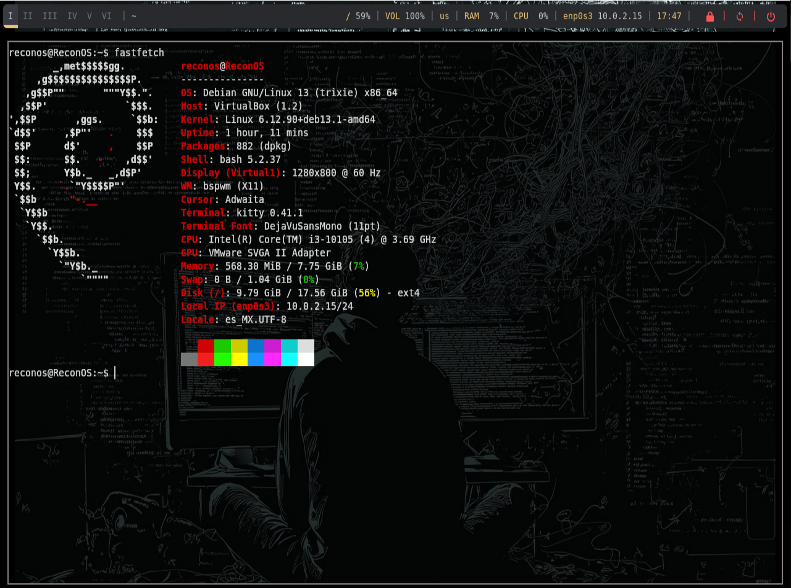

# 💻 ReconOS: Entorno de Desarrollo Minimalista & Optimizado

[](https://www.virtualbox.org/)
[](https://www.debian.org/)
[](https://github.com/baskerville/bspwm)
[](https://sw.kovidgoyal.net/kitty/)

Este repositorio alberga mis configuraciones personales (**Dotfiles**) y el entorno gráfico completo optimizado para desarrollo de software. Diseñado bajo una filosofía minimalista y de alto rendimiento, este setup elimina la carga de entornos pesados, priorizando el control total mediante teclado, la fluidez visual y una gestión de memoria ultra eficiente
---

## 📸 Vista Previa



---
## 📋 Especificaciones del Sistema de Origen

El entorno ha sido meticulosamente construido, depurado y empaquetado bajo las siguientes especificaciones técnicas. Si despliegas en un entorno similar, la compatibilidad está garantizada al 100%

* **Hipervisor / Virtualización:** Oracle VM VirtualBox (Optimizado para ejecución fluida en máquina virtual)
* **Distribución Base:** Debian GNU/Linux (a través del entorno especializado **ReconOS**)
* **Gestor de Ventanas (Window Manager):** `bspwm` (Tiling Window Manager basado en espacio particionado binario)
* **Gestor de Atajos de Teclado:** `sxhkd` (Simple X Hotkey Daemon)
* **Terminal Core:** `kitty` (Emulador de terminal multiplataforma acelerado por GPU, con soporte nativo de transparencias, fuentes *Nerd Fonts* y layouts avanzados)

---

## 🛠️ Ecosistema de Herramientas y Paquetes Incluidos

La instalación mediante este repositorio no solo aplica estilos visuales, sino que despliega un entorno de utilidades esenciales para administración de sistemas, redes y desarrollo:

### 🎨 Componentes de la Interfaz Visual
* **`polybar`**: Barra de estado modular y ligera ubicada en la sección superior, configurada para mostrar información crítica del sistema en tiempo real (CPU, RAM, red, espacios de trabajo).
* **`rofi`**: Lanzador de aplicaciones dinámico y menú de ventanas flotante, configurado con un tema oscuro/minimalista integrado plenamente con el flujo de trabajo del teclado.
* **`feh`**: Utilidad ligera encargada de la inyección y el renderizado adaptativo del fondo de pantalla (*wallpaper*) al inicializar el entorno X11.

### ⚙️ Monitoreo, Conectividad y Herramientas del Sistema
* **`btop`**: Monitor de recursos e historial de procesos interactivo en terminal, personalizado con esquemas de colores oscuros para un análisis preciso de rendimiento (CPU/GPU/RAM/Discos).
* **`ssh`**: Suite de conectividad nativa preconfigurada para túneles y conexiones remotas seguras.
* **`unzip`**: Herramienta de descompresión rápida indispensable para flujos de trabajo con dependencias externas.
* **`curl` & `git`**: Core del sistema para transferencia de datos y control de versiones distribuido.

---

## 📁 Estructura del Repositorio

Para que el script de instalación funcione correctamente, mantén la jerarquía de directorios estructurada de la siguiente manera antes de realizar el *push* definitivo:

```text
Dotfiles/
├── bspwm/
│   └── bspwmrc             # Script de inicialización de bspwm y llamadas a feh/polybar
├── sxhkd/
│   └── sxhkdrc             # Mapeo y definición de atajos de teclado del sistema
├── kitty/
│   └── kitty.conf          # Configuración de tipografía, opacidad y paleta de colores
├── rofi/
│   └── config.rasi         # Estilos y comportamiento del menú interactivo
├── polybar/
│   └── config.ini          # Módulos, fuentes y barras superiores del entorno
├── btop/
│   └── btop.conf           # Preferencias y temas visuales del monitor de procesos
├── install.sh              # Script automatizado de despliegue y aprovisionamiento
└── README.md               # Documentación técnica del entorno
```
---

## 🚀 Guía de Instalación y Despliegue Automatizado

El script `install.sh` se encarga de resolver dependencias de repositorios (`apt`), instalar los paquetes binarios requeridos, generar los directorios del usuario e inyectar las configuraciones en tu perfil local.

### 1. Clonar el repositorio
Accede a tu terminal e inicializa la descarga del entorno dentro de tu directorio de usuario:
```bash
git clone https://github.com/TU_USUARIO/mis-dotfiles.git
cd mis-dotfiles
```

### 2. Otorgar permisos y ejecutar el script
Ejecuta el script con privilegios de superusuario (`sudo`) cuando el gestor `apt` lo solicite para la instalación de binarios:
```bash
chmod +x install.sh
./install.sh
```

> ⚙️ **¿Qué automatiza este script?**
> 1. Sincroniza e indexa los repositorios mediante `sudo apt update`.
> 2. Descarga e instala los paquetes core de forma no interactiva (`bspwm`, `sxhkd`, `kitty`, `rofi`, `polybar`, `btop`, `unzip`, `ssh`, `feh`, `curl`, `git`).
> 3. Asegura la existencia del directorio base del usuario (`mkdir -p ~/.config`).
> 4. Copia las estructuras de diseño de manera aislada evitando sobreescribir configuraciones críticas del sistema base.

---

## ⌨️ Manual Técnico de Atajos de Teclado (Cheat Sheet)

El entorno se opera de forma nativa sin necesidad de ratón mediante combinaciones gestionadas por `sxhkd`. La tecla **`Super`** mapea la tecla física con el logo de Windows (o Command ⌘ en teclados Apple).

###  Control y Gestión de Ventanas (Nodos bspwm)

| Combinación | Acción de Sistema | Descripción Técnica |
| :--- | :--- | :--- |
| **`Super + W`** | `bspc node -c` | **Cerrar Ventana Activa:** Envía una señal limpia a la aplicación enfocada para que finalice su hilo de ejecución. |[cite: 3]
| **`Super + Shift + W`** | `bspc node -k` | **Forzar Cierre (Kill):** Envía una señal SIGKILL inmediata al proceso de la ventana actual (útil si la app se congela). |[cite: 3]
| **`Super + Shift + I`** | Minimizar / Ocultar | Envía el nodo actual a la pila de ventanas ocultas en el entorno gráfico. |[cite: 3]
| **`Super + I`** | Restaurar / Mostrar | Trae de vuelta al primer plano la última ventana enviada al estado oculto. |[cite: 3]

### 🚀 Lanzadores de Aplicaciones y Control del Entorno

| Combinación | Acción de Sistema | Descripción Técnica |
| :--- | :--- | :--- |
| **`Super + Enter`** | Lanzar `kitty` | Abre una nueva instancia limpia de la terminal acelerada por GPU. |[cite: 3]
| **`Super + D`** | Lanzar `rofi` | Despliega el buscador interactivo sobrepuesto para lanzar aplicaciones binarias. |[cite: 3]
| **`Super + Shift + R`** | Reiniciar `bspwm` | Re-ejecuta el script de entorno en caliente, aplicando cualquier cambio hecho en `bspwmrc` o `sxhkdrc` sin cerrar la sesión de usuario. |[cite: 3]

---

## 🎨 Personalización Avanzada del Wallpaper (`feh`)

El script de instalación copia tus configuraciones, pero el wallpaper requiere estar indexado correctamente. Para asegurar que tu fondo de pantalla no muestre una pantalla negra al iniciar, valida los siguientes puntos:

1. Coloca tu imagen favorita (ej. `wallpaper.png`) dentro de la ruta local de configuraciones: `~/.config/bspwm/`.
2. Asegúrate de que tu archivo `~/.config/bspwm/bspwmrc` contenga la siguiente instrucción en segundo plano:
   ```bash
   feh --bg-scale ~/.config/bspwm/wallpaper.png &

3. Ejecuta **`Super + Shift + R`** para recargar el gestor de ventanas y renderizar el nuevo diseño gráfico instantáneamente.
